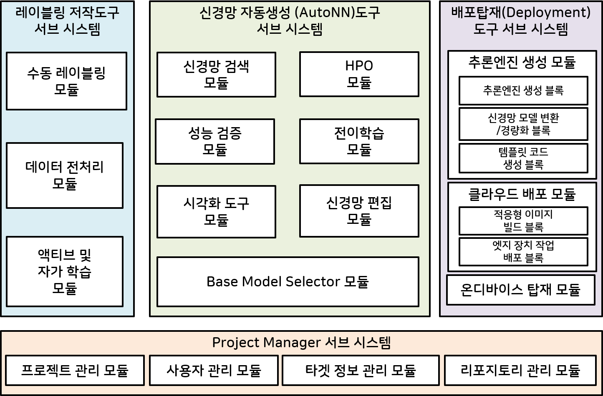
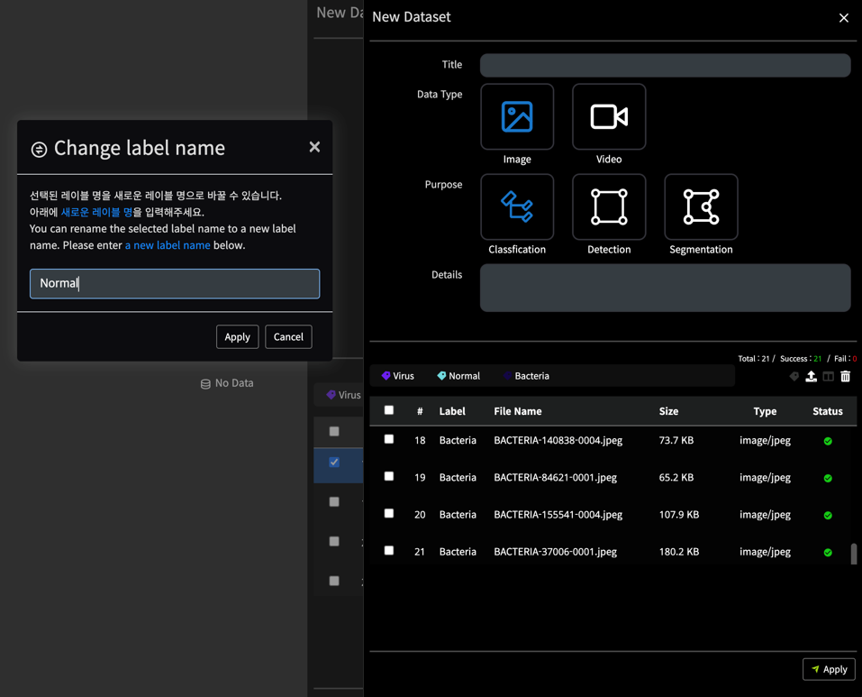
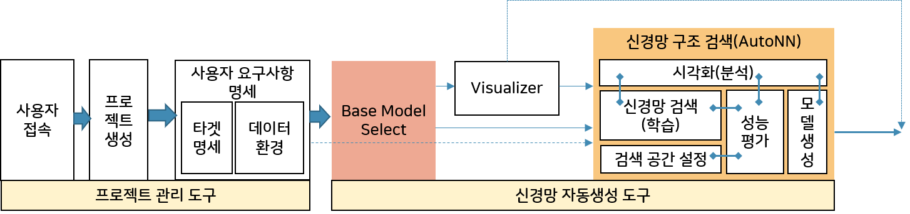
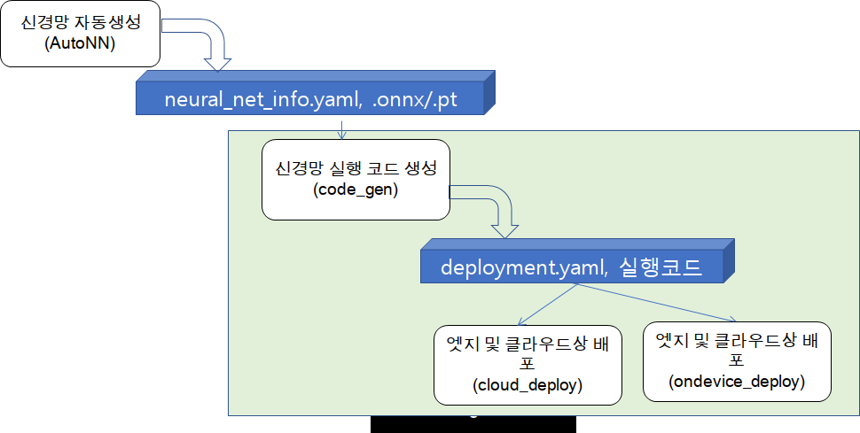
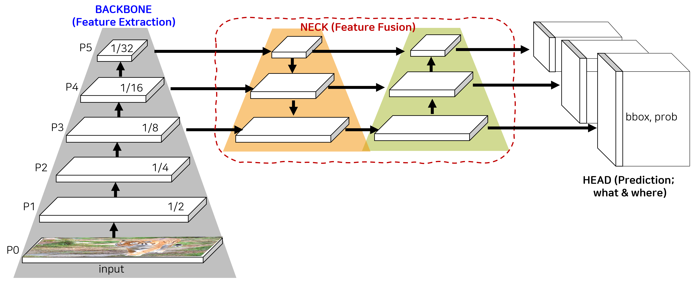
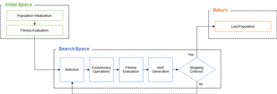
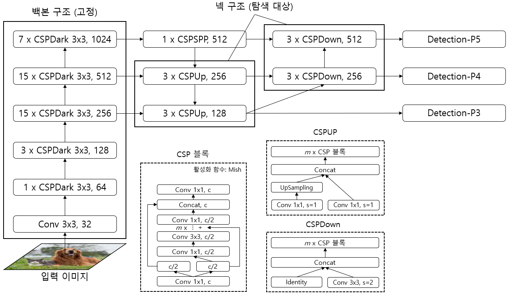
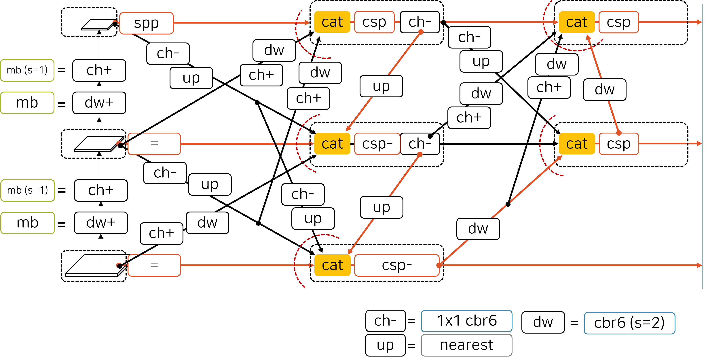
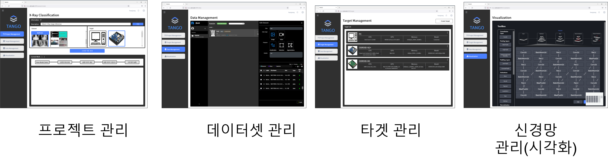

# TANGO

**Table of Contents**
* [Introduction to TANGO](#intro)
* [Source Tree Structure](#source_tree)
* [How to build images and run containers](#img_build_container_run)
  * [Docker and Docker-compose Installation](#docker_install)
  * [TANGO repository clone](#repo_clone)
  * [TANGO containers image build and run](#tango_run)
* [How to cleanup images and container instances outcomes](#clean_up)
* [How to run individual component containers](#per_container_run)
* [Developer Guides](#dev_guides)
* [Acknowledgement](#ack)

----

> **Announcement**  
> * [2022  Fall TANGO Community Conference](https://github.com/ML-TANGO/TANGO/discussions/31)
> * [2022  Fall TANGO Pre-Release](https://github.com/ML-TANGO/TANGO/releases/tag/tango-22.11-pre1)
> * [2022  Fall TANGO Release]()  - to be announced.
----

## Introduction to TANGO <a name="intro"></a>

TANGO (**T**arget **A**daptive  **N**o-code neural network **G**eneration and **O**peration framework) is code name of project for Integrated Machine Learning Framework.

It aims to develop automatic neural network generation and deployment framework that helps novice users to easily develop neural network applications with less or ideally no code efforts and deploy the neural network application onto the target device.

The users of TANGO just prepare their labelled datasets to train models and target devices. Then, TANGO analyzes the datasets and target devices characteristics, generates task-specific neural network based on user requirements, trains it with the datasets, creates Docker container images and deploys the container images onto target device.

TANGO uses container technology and MSA (Micro Service Architecture). Containers require less system resources than traditional or hardware virtual machine environments because they don't include operating system images. Applications running in containers can be deployed easily to multiple different operating systems and hardware platforms.

Each component of TANGO is self-contained service component implemented with container technology.
The component interacts with other component via REST APIs as depicted in the following image;


### AutoML <a name="automl"></a>

TANGO 프레임워크는 전문가의 도움을 받지 않거나 최소한의 사용법을 익힘으로써 자동으로 신경망을 구성하고 학습하여 사용자의 디바이스에서 바로 사용할 수 있는 모델을 배포, 탑재하는 것을 목표로 한다. 이를 위해 데이터 준비와 신경망 모델 생성, 그리고 디바이스 최적화까지는 하나의 프레임워크에서 통제할 수 있도록 하였다.



***

데이터 준비는 크게 두 가지 프로세스로 구성된다. 먼저 task에 맞는 다양한 상황에서의 이미지(raw data)를 직접 찍거나 모아야 한다. 그 다음 신경망에서 학습 가능한 형태로 주석을 달아 주어야 한다. 후자의 과정은 매우 노동 집약적이며 많은 인력과 시간이 소요된다. TANGO의 레이블링 도구는 raw data에 대해 annotation을 쉽게 수행하는 도구이다. 사용자는 로컬 데이터를 하나씩 로딩하고 task에 맞게 class labeling, bounding box annotation, polygon annotation 등을 수행한 후 저장할 수 있다.



***

신경망 모델 생성은 TANGO 프레임워크의 핵심 프로세스이며, 숙련된 AI 전문가들이 많은 시행착오를 겪으면서 수행하는 일이다. TANGO 프레임워크에서는 이를 자동으로 하기 위한 가이드라인을 제공한다. 먼저 기존의 잘 동작하는 것으로 알려진 신경망 중 하나의 추천하는 base model selector를 통해 기반 신경망을 추출한다. 이후 AutoNN에서는 NAS, HPO 등 자동화 기법을 활용하여 적절한 신경망 구성을 찾아낸다. 이는 최종 모델에 대한 재학습까지 포함한다.




#### BMS (Base Model Select)

NAS, HPO와 같은 자동화 기법을 적용하기 전에 그 검색 공간을 줄여주거나 특정한 신경망의 variation으로 한정시켜 주는 것은 신경망 자동 생성의 효율성 측면에서 매우 중요하다. TANGO 프레임워크에서는 이를 Base Model Select로 명명하고 기존의 잘 알려진 신경망 중 적절한 신경망을 추천하는 역할을 담당하도록 하였다.


#### NAS (Network Architecture Search)

최적의 신경망을 찾아내는 일은 오랜 기간 AI 전문가의 영역이었다. 이는 현재도 마찬가지이지만, 어느 정도 사용하는 연산(operation)과 레이어(layer), 블록(block) 혹은 셀(cell) 기술이 성숙되었기 때문에 이들을 조합하여 더 좋은 구조를 찾아내는 것은 단순한 반복 작업의 영역이 될 수 있다. 따라서 새로운 연산, 레이어, 블록, 셀을 찾아내기 보다는 기존의 연산, 레이어, 블록, 셀을 조합하거나 그 인자(arguments)를 바꿈으로써 더 좋은 신경망 구조를 찾아내는 일을 컴퓨터에게 맡긴 것이 NAS 기술이다. TANGO에서 NAS는 BMS에서 추천한 기반 신경망을 바탕으로 NAS를 통해 최적의 사용자 맞춤 신경망을 도출하는 과정이라고 볼 수 있다.

#### HPO (Hyper-Parameter Optimization)

신경망 학습은 많은 부분 자동화되어 있지만 여전히 전문가의 설정이 필요한 변수들이 많이 있다. 더구나 이들 변수의 설정은 학습을 잘 되게 하는데 매우 큰 영향을 끼치기 때문에 동일한 신경망 구조에 대해서도 전혀 다른 정확도 결과를 보일 수 있다. 하이퍼파라메터의 예로는 optimzer, weight decay, learning rate, warmup epochs, input size, early stopping, augmentation 등이 있다. 따라서 TANGO에서 HPO는 NAS가 끝난 후 최적 모델에 대해 최고의 성능을 내기 위한 학습 설정 변수를 정하는 과정이라고 볼 수 있다.

***

사용자는 신경망 추론에 사용할 디바이스를 지정할 수 있다. 디바이스별로 다른 가속화 엔진과 가용 자원 때문에 AutoNN에서 출력된 신경망 모델을 곧바로 배포/탑재하기 어려울 수 있다. 따라서 전주기 AutoML을 실현하기 위해 디바이스에 배포/탑재하여 동작할 수 있도록 도와주는 도구가 필요하다. 디바이스의 환경에 따라 직접 image build를 통해 네트워크로 배포할 수 있는 방식과 필수 라이브러리와 전/후처리 코드를 포함한 실행 코드르를 압축 파일로 만들어 사용자가 디바이스에 탑재하여 풀어 쓰는 방식을 제공하고 있다.



### Object Detection Neural Networks <a name="odnn"></a>

TANGO 프레임워크에서는 먼저 객체 검출 신경망의 자동 생성을 지원하도록 하였다. 객체 검출 신경망은 보통 백본, 넥, 헤드의 구성으로 이루어지며 각각 클래스(객체)에 대한 특징 추출, 객체의 위치를 잘 예측하기 위한 다중 크기의 특징 맵 병합, 그리고 어떤 객체가 어디에 위치하고 있는지 예측하는 역할을 담당하고 있다.



백본과 넥의 경우, 사용자가 추론에 쓰려는 디바이스의 한계와 검출하고자 하는 객체가 무엇인가에 따라 알맞은 모델이 다를 수 있다. 이를 자동으로 찾아내기 위하여 TANGO 프레임워크에서는 각각 Backbone NAS와 Neck NAS를 수행한다.
헤드의 경우, 실시간 객체 검출 신경망에서 주로 사용하는 YOLO 방식의 헤드를 사용하도록 하였다. 이 방식은 1-stage object detection에서 가장 성공적인 방식으로 알려져 있다. 현재 TANGO 프레임워크에서는 Backbone NAS와 Neck NAS를 선택하여 사용할 수 있도록 구성하였다.

#### Backbone NAS

TANGO 프레임워크가 지향하는 타겟 디바이스 맞춤형 백본을 찾기 위해 신경망 내 연산자별 지연시간 측정 기능을 모듈화하고 이를 기반으로 탐색 알고리즘의 복잡도 및 탐색 시간을 최소화하였다. 효율적인 다중 스케일 정보 추출을 위해 진화 알고리즘 기반의 신경망 구조 탐색 전략을 사용하여 weight-sharing supernet 학습을 수행함으로써 백본 신경망을 출력할 수 있도록 하였다.



***

#### Neck NAS

Neck NAS에서는 object detection 신경망에 특화된 Neck 영역의 NAS를 수행함으로써 객체 위치를 좀 더 정확히 예측할 수 있는 신경망을 찾기 위한 모듈이다. 그 방법 중 하나로서 YOLO의 FPN+PAN 구조를 기반으로 하여 블록 단위 검색을 수행하였다.



블록 단위의 탐색 블록을 정의한 위의 예시와 다르게, Neck 구조 자체에 대한 검색을 수행할 수도 있다. 이를 위해 YOLOv5의 Neck을 기반으로 Super-Neck을 만들어 어떤 연결이 가장 좋은 성능을 보이는지 탐색을 수행하였다.



### No-Code <a name="nocode"></a>

TANGO 프레임워크는 전문적인 지식이 없는 사용자도 자신만의 신경망 모델을 만들고 사용할 수 있도록 돕는 것을 목표로 한다. 이를 위해 프로젝트 매니저와 신경망 시각화 도구와 같이 사용자가 코드 작성 없이 사용할 수 있는 환경을 제공한다.



----

## Source Tree Structure <a name="source_tree"></a>

The source tree is organized with the MSA principles: each subdirectory contains component container source code. Due to the separation of work directory, component container developers just work on their own isolated subdirectory and publish minimal REST API to serve other component containers service request.

```bash
$ tree -d -L 2
.
├── project_manager            # front-end server for TANGO
│   ├── backend
│   ├── data
│   ├── tango
│   ├── frontend
│   └── static
│
├── labelling             # data labelling tool
│   ├── backend
│   └── labelling
│
├── base_model_select     # base model selection
│
├── autonn                # automatic neural network
│   ├── autonn
│   └── backend
│
├── target_image_build    # build neural network image to be deployed
│   ├── backend
│   └── target_image_build
│
├── target_deploy         # generated neural network deployment to target
│   ├── backend
│   └── target_deploy
│
├── visualization         # neural network model visualization
│
└── docs                  # project documentation

```

----


## How to build images and run containers <a name="img_build_container_run"></a>

If you have not installed the docker and docker-compose, please refer to following section.

### Docker and Docker-compose Installation <a name="docker_install"></a>

The descriptions in this sections are based on follow test environments:
* Linux Ubuntu 18.04 and 20.04 LTS

<details>
    <summary>System Prerequisite</summary>

```bash
sudo apt-get update

sudo apt-get install ca-certificates curl gnupg lsb-release

curl -fsSL https://download.docker.com/linux/ubuntu/gpg | sudo gpg --dearmor -o /usr/share/keyrings/docker-archive-keyring.gpg

echo "deb [arch=$(dpkg --print-architecture) signed-by=/usr/share/keyrings/docker-archive-keyring.gpg] https://download.docker.com/linux/ubuntu \
$(lsb_release -cs) stable" | sudo tee /etc/apt/sources.list.d/docker.list > /dev/null
```
</details>

<details>
    <summary>How to install docker engine</summary>

```bash
sudo apt-get update
sudo apt-get install docker-ce docker-ce-cli containerd.io
```

Check the installed `docker` version.

```bash
docker --version
```
</details>

<details>
    <summary>How to install NVIDIA container toolkit</summary>


TANGO can use GPU resources in some containers such as bms, autonn_nk, autonn_bb, etc.


You would consider installing NVIDIA container toolkit.


* Make sure you have installed the NVIDIA driver and Docker 20.10 for your linux machine.
* You do not need to install the CUDA toolkit on the host, but the driver need to be installed.
* With the release of Docker 19.03, usage of nvidia-docker2 packages is deprecated since NVIDIA GPUs are now natively supported as devices in the Docker runtime.

```bash
distribution=$(. /etc/os-release;echo $ID$VERSION_ID)

curl -s -L https://nvidia.github.io/nvidia-docker/gpgkey | sudo apt-key add -

curl -s -L https://nvidia.github.io/nvidia-docker/$distribution/nvidia-docker.list | sudo tee /etc/apt/sources.list.d/nvidia-docker.list

sudo apt-get update && sudo apt-get install -y nvidia-container-toolkit

sudo systemctl restart docker
```
* you can check the latest version info at https://github.com/docker/compose/releases/

```bash
sudo chmod +x /usr/local/bin/docker-compose
```

Check the installed `docker-compose` version.
```bash
docker-compose --version
```
</details>

<details>
    <summary>How to install docker-compose</summary>

```bash
sudo curl -L "https://github.com/docker/compose/releases/download/v2.6.1/docker-compose-$(uname -s)-$(uname -m)" -o /usr/local/bin/docker-compose
```
* you can check the latest version info at https://github.com/docker/compose/releases/

```bash
sudo chmod +x /usr/local/bin/docker-compose
```

Check the installed `docker-compose` version.
```bash
docker-compose --version
```
</details>

### TANGO repository clone <a name="repo_clone"></a>

Once youn installed docker and docker-compose in your local host system, you can clone the GitHub TANGO repository into local host

If you have registered your public key with your github ID, you can use following command
```bash
git clone git@github.com:ML-TANGO/TANGO.git
```

Please refer to  [How to Add SSH Keys to Your GitHub Account](https://www.inmotionhosting.com/support/server/ssh/how-to-add-ssh-keys-to-your-github-account/).


### TANGO containers image build and run<a name="tango_run"></a>

After cloning TANGO repository into your local host, change working directory into local TANGO repository.

```bash
cd TANGO
```

Build docker images and run the containers with `docker-compose` command.

```bash
docker-compose up -d --build
```
> Note 
> * run above command at directory where `docker-compose.yml` file is located.
> * `docker-compose up -d --build` requires a lot of times and sometimes it seems do nothing but it does something. **Be patient!!**

If you're in low bandwith Internet environment or using problematic DNS server, from time to time `docker-compose up -d --build` command would be interrupted by following errors(`Temporary failure in name resolution`):
```
failed to solve: rpc error: code = Unknown desc = failed to solve with frontend dockerfile.v0: 
failed to create LLB definition: 
failed to do request: Head "https://registry-1.docker.io/al tcp: lookup registry-1.docker.io: 
Temporary failure in name resolution
```
If this is your case, you should repeatedly run  `docker-compose up -d --build`  before to get the following message(**FINISHED**):
```
[+] Building 1430.5s (114/114) FINISHED
...
...
Use 'docker scan' to run Snyk tests against images to find vulnerabilities and learn how to fix them
[+] Running 9/10
...
```

Once previouse step completes successfule, following docker container images and containers can be found in your local host system.

**Example list of Docker images**

```bash
$ $ docker image ls
REPOSITORY                 TAG       IMAGE ID       CREATED              SIZE
tango_labelling            latest    08b7e0228997   About a minute ago   11.6GB
tango_viz2code             latest    0ba930ceb8e0   17 minutes ago       7.6GB
tango_autonn_nk            latest    ae9abca17942   32 minutes ago       10.9GB
tango_project_manager      latest    a1f70db5ce71   34 minutes ago       1.15GB
tango_target_deploy        latest    cc61506c133e   34 minutes ago       952MB
tango_target_image_build   latest    4e383c2f8344   34 minutes ago       957MB
postgres                   latest    901a82b310d3   7 days ago           377MB
mariadb                    10        14f1097913ec   2 weeks ago          384MB
```
* Note that the name of the docker images generated based on `docker-compose.yml` is prefixed by its folder name (e.g, `'tango_'`)

**Example list of Docker containers**
```bash
$ docker ps -a --format "table {{.Image}}\t{{.Names}}\t{{.Status}}\t{{.Command}}\t{{.Ports}}"
IMAGE                      NAMES                        STATUS          COMMAND                  PORTS
tango_project_manager      tango-project_manager-1      Up 51 seconds   "sh -c 'chmod 777 ./…"   0.0.0.0:8085->8085/tcp, :::8085->8085/tcp
tango_labelling            tango-labelling-1            Up 51 seconds   "./start.sh"             0.0.0.0:8086->80/tcp, :::8086->80/tcp, 0.0.0.0:8095->10236/tcp, :::8095->10236/tcp
tango_viz2code             tango-viz2code-1             Up 51 seconds   "sh -c 'cd ./visuali…"   0.0.0.0:8091->8091/tcp, :::8091->8091/tcp
postgres:latest            tango-postgresql-1           Up 52 seconds   "docker-entrypoint.s…"   5432/tcp
tango_target_image_build   tango-target_image_build-1   Up 52 seconds   "sh -c 'python manag…"   0.0.0.0:8088->8088/tcp, :::8088->8088/tcp
tango_autonn_nk            tango-autonn_nk-1            Created         "sh -c 'python manag…"
mariadb:10                 mariadb                      Up 51 seconds   "docker-entrypoint.s…"   0.0.0.0:3306->3306/tcp, :::3306->3306/tcp
tango_target_deploy        tango-target_deploy-1        Up 52 seconds   "sh -c 'python manag…"   0.0.0.0:8089->8089/tcp, :::8089->8089/tcp

```
* Note that the name of the docker containers genrated based on `docker-compose.yml` is prefixed by its folder name (e.g, `'tango_'`) and suffixed by the its instance ID (e.g, `'_1'`).

**TANGO in Web-browser**

Now you can launch web browser and open URL `http://localhost:8085` or `http://aaa.bbb.ccc.ddd:8085`.

* `aaa.bbb.ccc.ddd` is your host's DNS address or IP address.
* `8085` is published port from `TANGO_web_1` container, which acts as front-end server of TANGO.

Then you can see the login page of TANGO as follows:


Once you can find the login page in the web browser, register new account and password and use the newly created account and password to login.


----

## How to cleanup docker images and container instances <a name="clean_up"></a>

When you want remove all the images and containers prviously built and run, you can use following commands;
```bash
# tear down all containers and remove all docker images created and volumes.
$ docker-compose down --rmi all --volumes

#or tear down all containers and remove all docker images created except for volumes.
$ docker-compose down --rmi all 

# remove all images in the local docker host for preventing cached image layers side effect
# when you are to build from the zero base.
docker system prune -a

# remove labelling dataset related folder if you want to start from the empty datasets
$ sudo rm -rf ./labelling/data/
$ sudo rm -rf ./labelling/datadb/
$ sudo rm -rf ./labelling/dataset/
```

> **Note**  
> * Run above command at project root directory (e.g `'TANGO'`) where `docker-compose.yml` file is.
> * Ater running of above commands, your account on project manager as well as datasets prepared with `labelling` tool are removed, due to  `--volumes` option.
> * Hence, you recreate account for project manager and dataset from the scratch.

----

## How to run individual component containers <a name="per_container_run"></a>

Currently we have following component containers;

* **labelling** : dataset labelling authoring tool: 
* **autonn**: automatic neural network creation: 
* **target_image_build**: target deployment image build
* **target_deploy**: image deployment to target: 

For testing or debugging of the individual component container, you want to run container individually.

First of all, check your current working branch is `main`.

```bash
$ git branch -a
* main
  remotes/origin/HEAD -> origin/main
  remotes/origin/main
  remotes/origin/sub
```


<details>
    <summary>labelling: container for labelling tool </summary>

Change current working directory into `labelling` and image build with `Dockerfile`
```bash
cd labelling
docker build -t labelling .
```

`labelling` container run
```bash
docker run -d --name labelling -p 8086:80 labelling:latest
```
</details>


<details>
    <summary> autonn: container for automatic neural network creationn </summary>

:warning:<span style='background-color:#dcffe4'>Currently, autonn consists of two different NAS modules, **neck-nas** and **backbone-nas**.</span>  
You should build both of them at each directory respectively.
***
For **backbone NAS**, change current working directory into `autonn/backbone-nas` and  image build with `Dockerfile`

```bash
cd ../autonn/backbone_nas
docker build -t autonn_bb .
```

`autonn_bb` container run  
Be careful not to get the port number wrong, `8087` is allocated for backbone-nas

```bash
docker run -d --name autonn_bb -p 8087:8087 -v autonn_bb:latest
```

If CUDA is available, you can use `--gpus=all` options

```bash
docker run -d --gpus=all --name autonn_bb -p 8087:8087 autonn_bb:latest
```

When you run into shared memory shortage, you should use `--ipc=host` options

```bash
docker run -d --gpus=all --ipc=host --name autonn_bb -p 8087:8087 autonn_bb:latest
```

***
Similary for **neck NAS**, change current working directory into `autonn/neck-nas` and  image build with `Dockerfile`

```bash
cd ../autonn/neck_nas
docker build -t autonn_nk .
```

`autonn_nk` container run  
Be careful not to get the port number wrong, `8089` is allocated for neck-nas

```bash
docker run -d --name autonn_nk -p 8089:8089 autonn_nk:latest
```

If CUDA is available, you can use `--gpus=all` options

```bash
docker run -d --gpus=all --name autonn_nk -p 8089:8089 autonn_nk:latest
```

When you run into shared memory shortage, you should use `--ipc=host` options

```bash
docker run -d --gpus=all --ipc=host --name autonn_nk -p 8089:8089 autonn_nk:latest
```
</details>


<details>
    <summary>target_image_build: container for target deployment image build</summary>

Change current working directory into `target_image_build` and image build with `Dockerfile`

```bash
cd ../target_image_build/
docker build -t target_image_build .
```

`target_image_build` container run

```bash
docker run -d --name target_image_build -p 8088:8088 target_image_build:latest
```
</details>


<details>
    <summary> target_deploy: container for image deployment to target</summary>

Change current working directory into `target_deploy` and image build with `Dockerfile`

```bash
cd ../target_deploy/
docker build -t target_deploy .
```

`target_deploy` container run
```bash
docker run -d --name target_deploy -p 8089:8089 target_deploy:latest
```
</details>

----

## Developer Guides and References<a name="dev_guides"></a>

* [TANGO Architecture Overview](https://github.com/ML-TANGO/TANGO/wiki/Guides-%7C-TANGO-Architecture)
* [TANGO Container Port Mapping guide](https://github.com/ML-TANGO/TANGO/wiki/Guides-%7C-Container-Port-Map)
* [Exchanging Data among Containers](https://github.com/ML-TANGO/TANGO/wiki/Guides-%7C-Exchanging-Data-among-Containers)
* [TANGO REST API Guide](https://github.com/ML-TANGO/TANGO/wiki/Guides-%7C-Rest-API)

----

## Acknowledgement <a name="ack"></a>

This work was supported by [Institute of Information & communications Technology Planning & Evaluation (IITP)](https://www.iitp.kr/) grant funded by the Korea government(MSIT) (**No. 2021-0-00766**, _Development of Integrated Development Framework that supports Automatic Neural Network Generation and Deployment optimized for Runtime Environment_).
